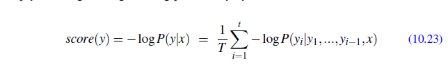

# Chapter 10 - Transformers and Pretrained Language Models

- **Page 224, Equation 10.23**:

    Negative sign appears out of blue without explanation. Simply dividing by the length is enough and more appropriate because equation `10.22` does not have negative sign in the first place.

    
