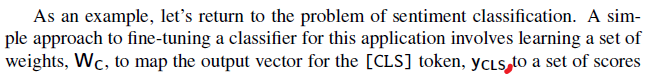

# Chapter 11 - Transfer Learning Through Fine-Tuning

- **Page 234, Equation 11.9**:

    Indices in the right hand side should be $y_s$, $y_e$, and $p_i$ according to descriptions just above the formula. `s` already refers to the position of the word before the span, so subtracting 1 from `s` is not correct. Similar argument applies to `e` and `i`. Current indices do not correspond to neither the description nor to `Figure 11.6`.

- **Page 235, Figure 11.6**:

    Arrows from negative log loss to softmax layer should be reversed to comply with other figures. It is also more intuitive to think that loss is calculated from the output of the softmax layer.

- **Page 237, Explanation Sequence Classification**:

    Missing comma after $y_{\textbf{cls}}$.

    

- **Page 238, Figure 11.8**:

    $y_{\textbf{cls}}$ should be the last hidden layer of the encoder, not the final output after the softmax layer according to equation 11.11.

    
