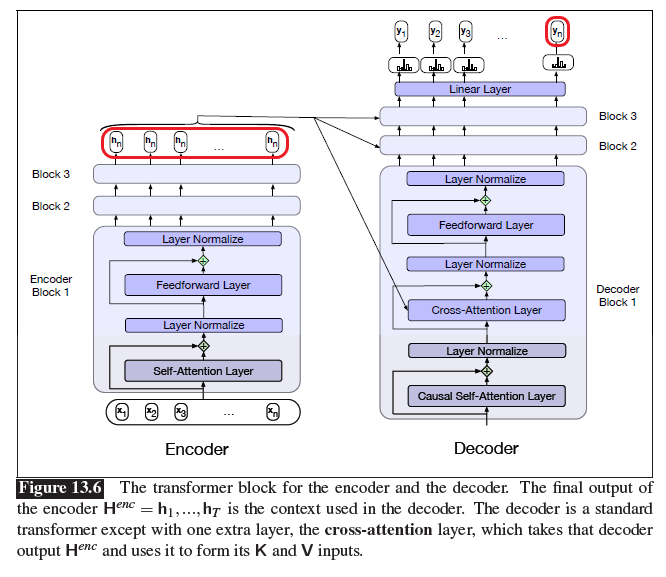

# Chapter 13 - Machine Translation

- **Page 257, Figure 13.6**:

    Encoder hidden layer indices should be from $1$ to $n$.

    Output length is not dependent on input length. Index of the last $y$ should be $m$ instead of $n$.

    
