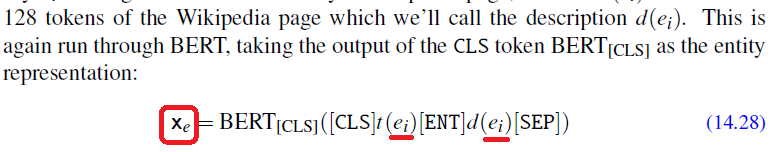
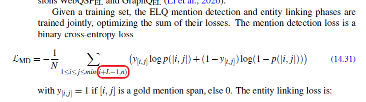

# Chapter 14 - Question Answering and Information Retrieval

- **Page 286, Equation 14.28**:

    Left hand side of the equation should be yei.

    

- **Page 286, Equation 14.31**:

    `L` in the sum formula is not defined.

    
