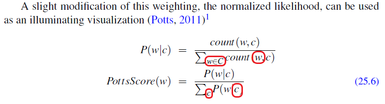

# Chapter 25 - Lexicons for Sentiment, Affect and Connotation

- **Page 506, Equation 25.6**:

    `w` in sum index of probability calculation should be replaced with `w'`. Similarly, `c` should be replaced with `c'` in the bottom equation. Otherwise, these are overloaded.

    
