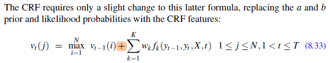

# Chapter 8 - Sequence Labeling for Parts of Speech and Named Entities

- **Page 179, Formula 8.33**:

    The formula has `+` sign in between vt-1(i) and sum of weighted local features. Should be a multiplication sign `*` instead.
    
    
