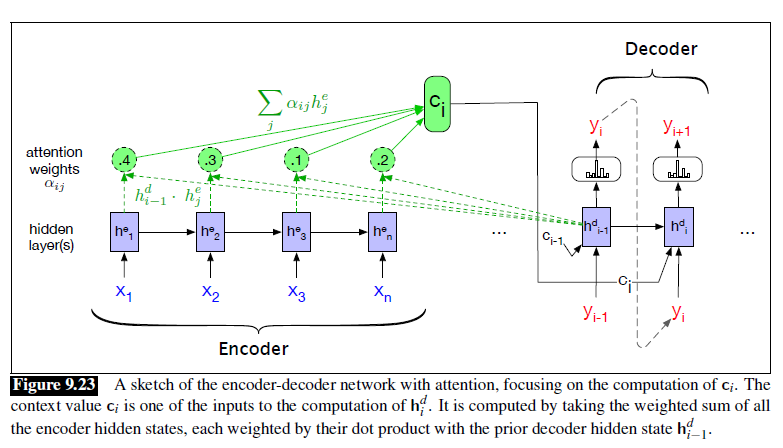
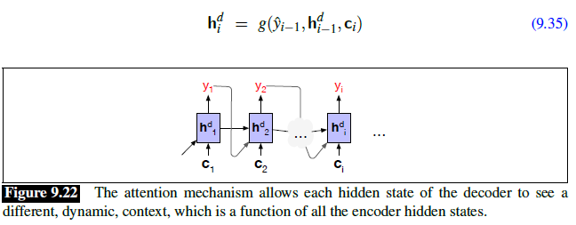

# Chapter 9 - RNNs and LSTMs

- **Page 208, Figure 9.23**:

    yi is computed from hi-1 and hi is computed using yi which is not consistent with the previous figures and formulas. 

    

    In Figure 9.22, yi is computed from hi and in Equation 9.35, hi is computed from yi-1.
    
    
