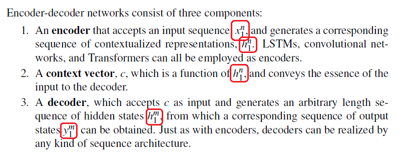

# Chapter 9 - RNNs and LSTMs

- **Page 190, Equation 9.7**:

    `i` used both as a word and as an index. Overloading is unnecessary and confusing.

    

- **Page 202, Explanation of Components of Encoder Decoder Networks**:

    Superscript is used to imply the end index of the sequence which is not consistent with the chapter and the book. For input sequence x1:n is used throughout the book. Here, xn1 is used. Same problem exists for the output sequence y1:m.

    

- **Page 204, Figure 9.18**:

    Output length is not dependent on input length. Index of the last y should be m instead of n.

    

- **Page 208, Figure 9.23**:

    yi is computed from hi-1 and hi is computed using yi which is not consistent with the previous figures and formulas. 

    

    In Figure 9.22, yi is computed from hi and in Equation 9.35, hi is computed from yi-1.
    
    
